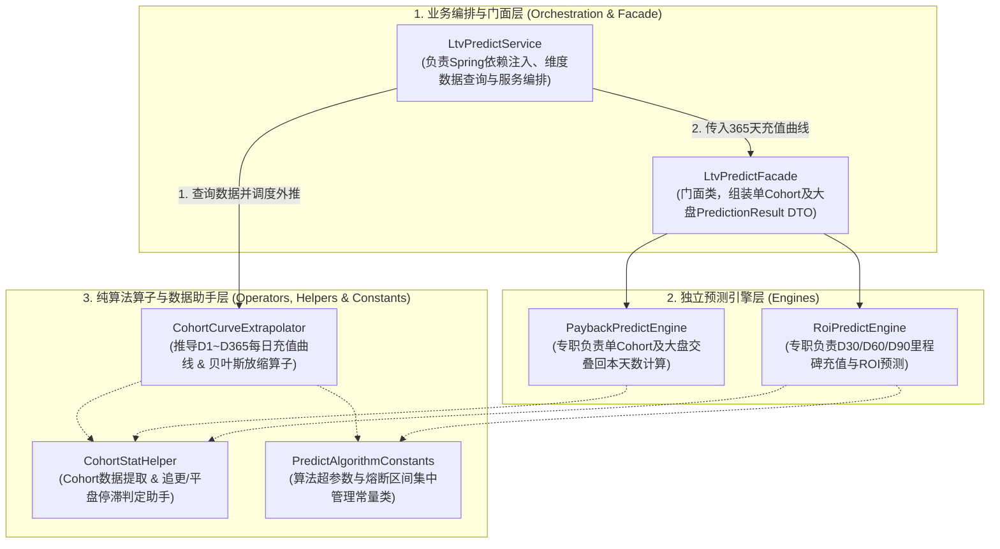
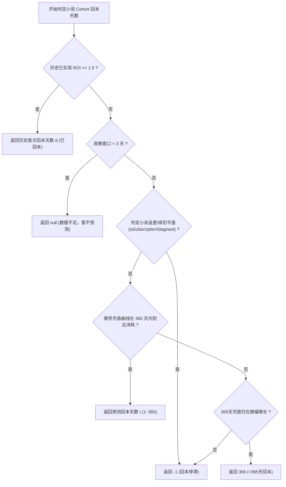

# 预测回本模型（Payback Prediction Model）详解

本文档详细说明 `ltv-stat-system` 统计与预测系统针对 **海外 H5 小说投放（Overseas H5 Web Novel Ad Campaigns）** 业务场景下的 **预测回本模型（Payback Prediction Model）** 的业务背景、数学原理、算法推导步骤、模块解耦架构设计与边界防守机制。

---

## 一、 业务背景与核心目标 (Business Context & Objectives)

### 1. 业务背景
在海外 H5 小说（Web Novel）广告投放中，团队主要通过 **Meta (Facebook)、TikTok、Google** 等渠道投放小说落地页（H5 Landing Page）进行买量获取读者（Cohort 批次）。

海外 H5 小说业务的变现与充值具有显著的行业特征：
1. **多元化变现模式**：
   - **单次/金币充值 (Coin Packs)**：读者在关键卡点章节（Paywall Chapter）购买金币解锁后续章节。
   - **VIP 订阅 (Weekly/Monthly Subscriptions)**：周订（Period = 7）、月订（Period = 30）等自动续费订阅模式。
2. **充值回弹与长尾追更 (Long-tail Repeat Purchases)**：
   - **首日爆发**：落地页诱导章节卡点触发读者首日冲动消费（D1 充值占比较高）。
   - **完本追更与续扣脉冲**：忠实读者在随后的第 7 天、14 天、30 天继续追更完本，或触发周卡/月卡自动续扣，产生长尾复购。
3. **关键决策需求**：
   优化师需要根据前 **3~7 天的早期充值与续扣数据**，精准预测当前落地页/广告账户批次在未来 365 天内的 LTV 增长曲线与回本周期（Payback Period），据此决定**账户消耗（Spend）加倍还是关停**。

### 2. 核心目标
- **高早期准确率**：在 D3 / D5 / D7 观察窗口下，平均绝对误差 MAE ≤ 2.5 天，±3 天命中率 > 85%。
- **混合变现建模**：完美适配单次金币充值复购与周订（Period = 7）、月订（Period = 30）等多订阅周期的划扣脉冲。
- **健壮的防守机制**：包含贝叶斯先验收缩、均值回归衰减、追更平盘熔断以及 OLS 对数拟合兜底。

---

## 二、 解耦架构设计 (Refactored Decoupled Architecture)

系统采用 **3 层解耦架构（编排层 - 独立引擎层 - 纯算子与助手工具层）** 与 **自下而上（Bottom-Up）独立 Cohort 叠加** 模式，彻底消除了类与类之间的双向/逆向依赖：

---

## 三、 核心算法与推导步骤 (Core Algorithms & Mathematical Steps)

### Step 1: 建立或匹配小说基准曲线 (Benchmark Baseline Matching)

针对 Cohort 中解析出的订阅周期 P（单次/日订 P = 1, 周订 P = 7, 月订 P = 30 等）：
1. 优先从数据库匹配该小说落地页/渠道维度（如维度类型 `USER` 或 `ALL`）由历史成熟 Cohort（Age ≥ 14 天）萃取出的网文基准线：
   - `baseRet[d]`：第 d 天的基准留存/续订率；
   - `baseArpu[d]`：第 d 天的基准单客 ARPU（含金币复购与自动续扣）。
2. 若无历史数据，启用 **网文合成基准线 (Synthetic Standard Benchmark Fallback)**：
   - **周订 / 月订**：在划扣节点 d = 1, P+1, 2P+1 ... 按衰减指数建模：
     baseRet[d] = 0.55 ^ (cycleIndex - 1)
   - **单次/日订**：按小说读者流失与追更规律的幂律衰减建模：
     baseRet[d] = 1 / (d ^ 0.75)
3. **90 天后小说完本尾部长尾衰减**：
   baseRet[d] = baseRet[90] × (90 / d) ^ 1.2  (d > 90)

---

### Step 2: 计算初始放缩因子与贝叶斯先验收缩 (`CohortCurveExtrapolator.computeOptimalScaleFactor`)

根据已知观察天数 maxDays = min(daysElapsed, 60)，计算当前小说批次的实际累计 ROI 与基准预期 ROI 总和：

actualRoi = actualRecharge / spend

baseRoiSum = Σ (baseRet[d] × unitPrice_d × userCount) / spend

未收缩的原始放大系数：

α_raw = actualRoi / baseRoiSum

#### 贝叶斯先验收缩与离群点熔断 (Empirical Bayes & Outlier Clamping)

- **极早期（maxDays < 7 天）**：
  由于前 1~3 天读者充值容易受到个别“土豪读者”大额金币充值影响，加入消耗金额加权先验收缩，防止小消耗大充值导致预测过度乐观：
  α = (actualRoi + priorWeight) / (baseRoiSum + priorWeight)
  其中 priorWeight = clamp(0.05, 0.20, (1000 / spend) × 0.05)。
  限制 α ∈ [`EARLY_STAGE_MIN_ALPHA`, `EARLY_STAGE_MAX_ALPHA`]（即 `[0.80, 1.25]`），贝叶斯权重 w = 0.15 + 0.10 × (maxDays / 7)。

- **成熟期（maxDays ≥ 7 天）**：
  跨过首个小说周卡/月卡续扣节点后，Sigmoid 强信任真实续扣与复购数据：
  α = clamp(`MATURE_STAGE_MIN_ALPHA`, `MATURE_STAGE_MAX_ALPHA`, α_raw)（即 `[0.60, 2.00]`），权重 w = 0.85 + 0.10 × (min(53, maxDays - 7) / 53)。

最终放缩因子：

scaleFactor = w × α + (1.0 - w) × 1.0

---

### Step 3: 未来 365 天充值曲线推导与双重衰减 (Curve Extrapolation & Scale Decay)

从 t = maxDays + 1 至 365 天进行逐日外推：

1. **均值回归衰减 (Scale Decay)**：
   放缩系数随读者阅读完本向网文行业大盘 1.0 平滑回归：
   scaleDecay(t) = (maxDays / t) ^ `SCALE_DECAY_EXPONENT` （`SCALE_DECAY_EXPONENT = 0.35`）
   effectiveScaleFactor(t) = 1.0 + (scaleFactor - 1.0) × scaleDecay(t)

2. **周期续订/复购自然衰减 (Cycle Decay)**：
   cycleDecay(t) = (7 / t) ^ `CYCLE_DECAY_EXPONENT` （`CYCLE_DECAY_EXPONENT = 0.06`）  (t > 7)

3. **每日预测充值累加**：
   在划扣/追更节点上计算当日预测新增充值收入 ΔR(t)：
   ΔR(t) = baseRet[t] × effectiveScaleFactor(t) × cycleDecay(t) × renewPrice × userCount
   cumRecharge[t] = cumRecharge[t-1] + ΔR(t)

---

## 四、 关键边界条件与防守熔断机制 (Safeguards & Edge Cases)

### 1. 通用网文订阅/复购平盘停滞判定 (`CohortStatHelper.isSubscriptionStagnant`)
根据小说 Cohort 中解析出的最长订阅/复购周期 P_max，动态计算平盘观察窗口：

requiredFlatDays = max(`MIN_FLAT_DAYS`, P_max × `PERIOD_FLAT_MULTIPLIER`) （即 `max(6, P_max × 2)`）

- **单次/日订** (P ≤ 3)：连续 6 天充值增长 ≤ $0.01，表明读者弃书/完本停读，判为回本停滞。
- **周卡/周订** (P = 7)：连续 14 天（2 周）充值增长 ≤ $0.01，表明读者连续 2 期未续费，判为回本停滞。
- **月卡/月订** (P = 30)：连续 60 天（2 个月）充值增长 ≤ $0.01，表明读者连续 2 个月未续费，判为回本停滞。

若触发停滞，未来预测充值曲线平盘，回本天数返回 `-1`。

### 2. OLS 线性对数拟合兜底 (`CohortCurveExtrapolator.predictCohortOlsFallback`)
当缺少有效网文历史基准线时，利用历史充值点通过最小二乘法对数拟合 R(t) = a × ln(t) + b，当 a > 0.0001 时求得解析解：

t_payback = exp((1.0 - b) / a)

### 3. 大盘整体回本天数 (`PaybackPredictEngine.calculateOverallPaybackDays`)
对于广告主/整体小说平台视角，采用 **自下而上（Bottom-Up）自然日历对齐算法**：
- 按各个 H5 落地页/广告账户 Cohort 真实的 `launchDate` 在自然日历上逐日求和大盘预测充值曲线；
- 解决不同批次小说 Cohort 处于不同生命周期阶段（如老广告组与新测试广告组）的交叠累加问题；
- 若大盘预测充值曲线在未来某天达到总消耗金额，计算相对于今天的剩余天数。

---

## 五、 源码类与方法映射表 (Source Code Mapping)

| 包名 / 类名 | 关键方法 / 字段 | 职责说明 |
| :--- | :--- | :--- |
| `com.ltv.stat.service.LtvPredictService` | `predictCohortDailyRechargeCurve` | 编排层，匹配数据并调度外推引擎生成 D1~D365 全量预测充值曲线 |
| `com.ltv.stat.service.engine.LtvPredictFacade` | `assembleCohortPrediction` / `assembleOverallPrediction` | 门面类，分发调度引擎并组装单 Cohort 及大盘 `PredictionResult` DTO |
| `com.ltv.stat.service.engine.PaybackPredictEngine` | `calculateCohortPaybackDays` / `calculateOverallPaybackDays` | 引擎层，计算单 Cohort 真实已回本天数、未来交叉回本点及大盘交叠回本 |
| `com.ltv.stat.service.engine.RoiPredictEngine` | `calculateCohortRoiTrend` | 引擎层，提取 D30/D60/D90 里程碑，施加单调递增约束与动态上限保护 |
| `com.ltv.stat.service.engine.CohortCurveExtrapolator` | `computeOptimalScaleFactor` / `predictCohortOlsFallback` | **纯算子引擎**，计算贝叶斯放缩因子与 OLS 线性对数拟合 |
| `com.ltv.stat.util.CohortStatHelper` | `getRechargeForDay` / `isSubscriptionStagnant` | **数据与状态助手**，解耦提供 Cohort 充值提取与追更/平盘停滞判定 |
| `com.ltv.stat.service.engine.PredictAlgorithmConstants` | `SCALE_DECAY_EXPONENT` / `MATURE_STAGE_MAX_ALPHA` 等 | **常量管理**，集中存放所有算法超参数、熔断阈值与上限配置 |
| `com.ltv.stat.service.LtvBenchmarkService` | `getBenchmarkCurve` | 查询与萃取网文历史成熟 Cohort 的留存与 ARPU 基准线 |

---

## 六、 总结

预测回本模型在完美结合 **海外 H5 小说变现特征（金币卡点解锁 + VIP 周/月卡续订）** 的基础上，实现了**代码结构与数学算法的高度解耦**。通过 **数据助手 + 纯算子 + 超参数集中管理 + 独立预测引擎** 的架构设计，既保障了优化师在买量早期（D3~D7）预测极高的准确度与决策稳定性，又极大提升了系统的可扩展性与代码可维护性。
